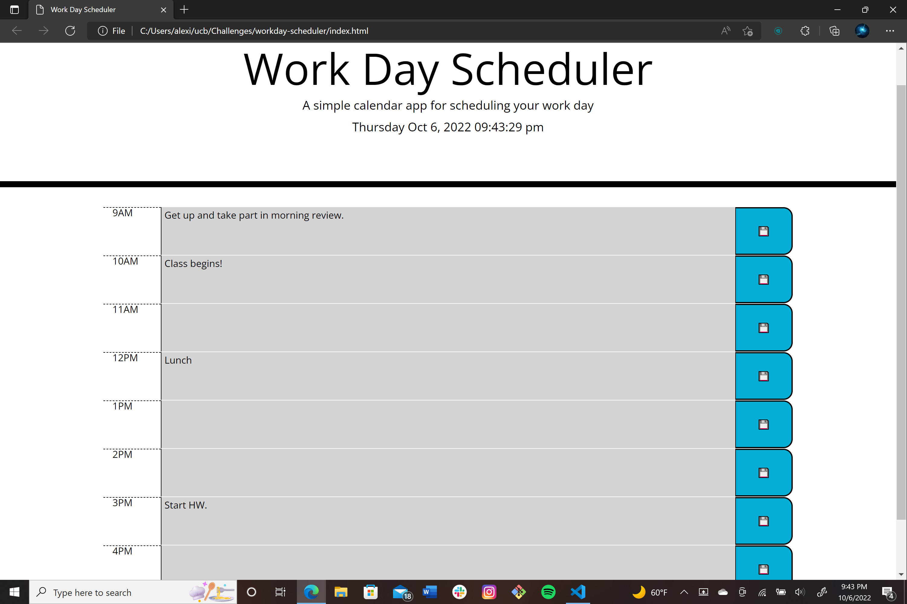

# Workday Schedule

## Description

The goal of this project was to make a calendar that saves events entered by the user. This was done using jQuery and Bootstrap to display the calendar on the page.


## [Webpage](https://turtle2001.github.io/workday-scheduler/)


## Code Snippet
```JavaScript
for (i = 9; i < 18; ++i) {
    if ((moment().hours() == i))
        $('#' + i).attr('class', 'description col-10 present')
    else if ((moment().hours() < 9))
        $('#' + i).attr('class', 'description col-10 future')
}
```

## Author Links
[LinkedIn](https://www.linkedin.com/in/alexis-zaragoza-5baa51242/)
[GitHub](https://github.com/turtle2001)
